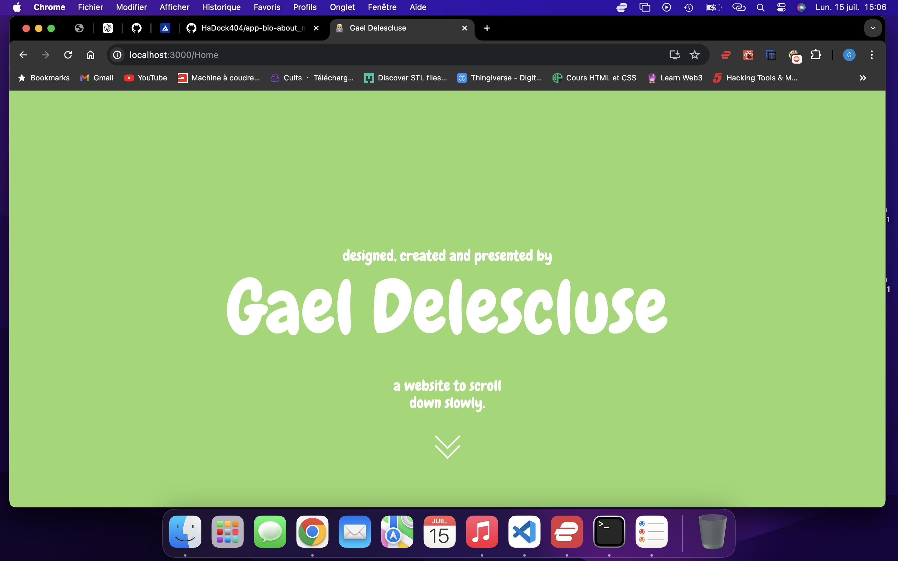
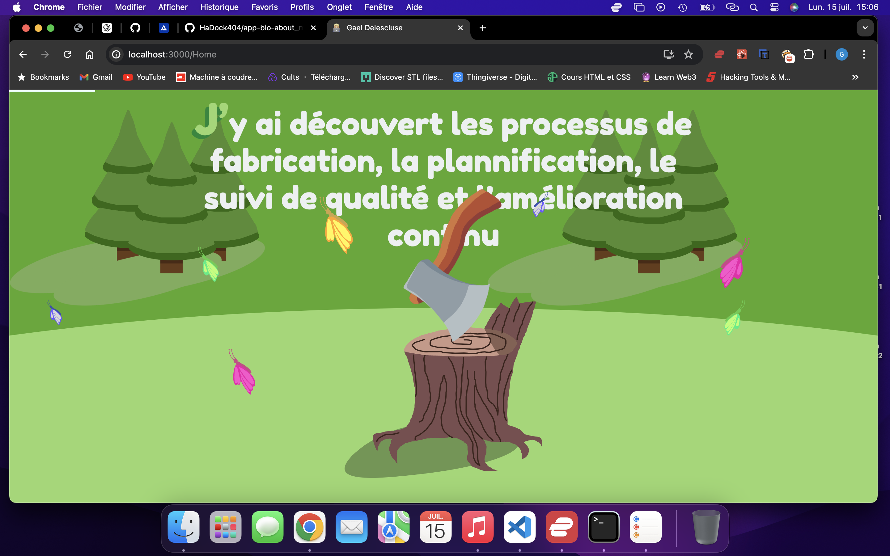
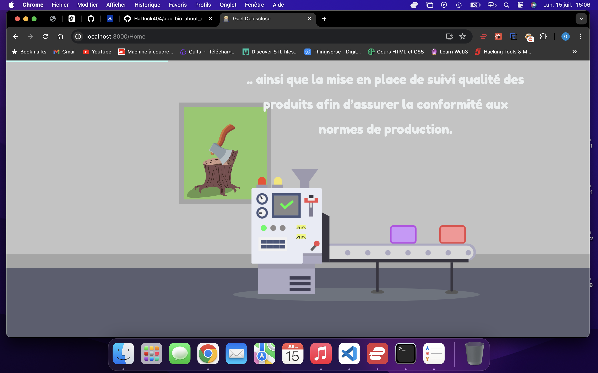
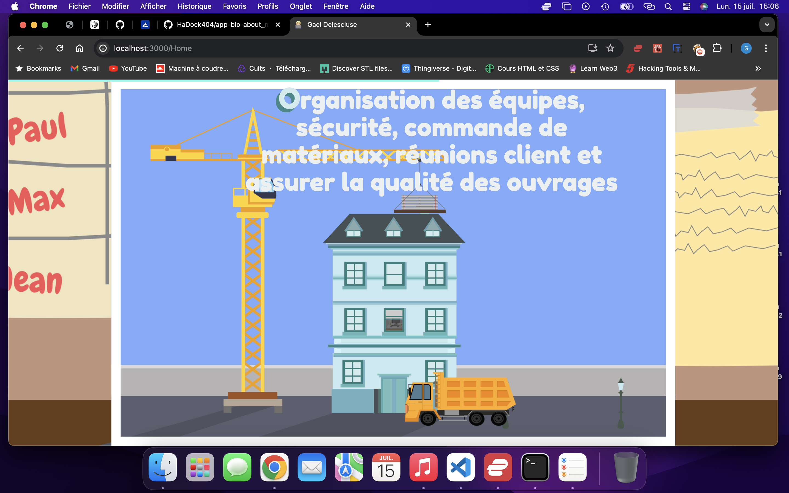
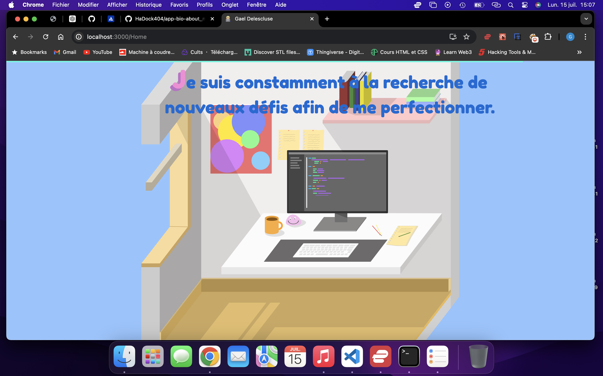

# APP About Me

[](LICENSE)

Here is my presentation app using React that provides a simple and powerful interface while maintaining app performance.   

## Description  

This application enables me to present my professional experience in an interactive way for the user by activating different animations using the page scroll. The images were designed and drawn by me then transformed into SVG to maintain the same quality depending on the different screen sizes.  

Here some exemples of the differents stages of the application.  







## Table of Contents

- [Getting Started with Create React App](#Getting-Started-with-Create-React-App)
- [Launch Application](#Launch-Application)
- [Contributing](#Contributing)
- [License](#License)  

## Getting Started with Create React App

This project was bootstrapped with [Create React App](https://github.com/facebook/create-react-app).  

```bash
git clone https://github.com/HaDock404/app-bio-about_me.git
cd app-bio-about_me 
npm install
```  

## Launch Application   

```bash
npm start
```  

Runs the app in the development mode.\
Open [http://localhost:3000](http://localhost:3000) to view it in your browser.

The page will reload when you make changes.\
You may also see any lint errors in the console.

## Contributing

Pull requests are welcome. For major changes, please open an issue first
to discuss what you would like to change.

Please make sure to update tests as appropriate.

## License  

This project is licensed under the MIT License - see the [LICENSE](./LICENSE) file for details.